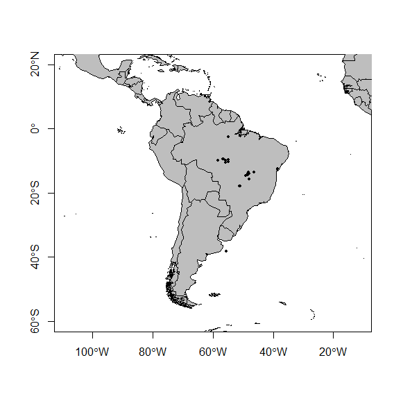

## **Introdução** 
O gênero *Helicops* descrito por Wagler 1830 (Serpentes: Dipsadidae: Xenodontinae) é composto por 17 espécies de serpentes de hábitos aquáticos (Costa et al., 2016), amplamente distribuídos na América do Sul com ocorrência fortemente associada às bacias hidrográficas do continente (Albuquerque, 2002; Yuki and Lema, 2005; Ávila et al., 2006). O gênero *Helicops* se diferencia do demais hydropsínios pela ornamentação hemipeniana diferenciada, diagnosticada pela presença de franjas nuas nos lobos do hemipênis (Zaher, 1999). No tocante a morfologia externa, o gênero *Helicops* se diferencia plenamente de *Pseudoeryx* e *Hydrops* pela presença de escamas dorsais quilhadas (Peters and Orejas-Miranda, 1970; Di Pietro et al., 2014; Costa et al., 2016). A morfologia hemipeniana representa a principal fonte de informações que dá identidade ao gênero como uma entidade à parte em Hydropsini.

### **Objetivo**
Investigar a presença de dimorfismo sexual em quatro espécies de *Helicops*.

## **Material e Métodos**
### Amostragem
Foram analisados 38 espécimes identificados como *SP1, SP2, SP3 e SP4 * disponíveis ao longo de sua cobertura geográfica depositados em 3 coleções científicas nacionais: Museu Nacional do Rio de Janeiro (MNRJ), Coleção Herpetológica da Universidade Federal de Mato Grosso (CHUFMT) Coelão Herpetológica da Pontifícia Universidade Católica de Goiás (CHPUCGO).

A determinação do sexo dos exemplares foi feita com base na presença ou ausência do órgão copulador masculino, hemipênis. Uma incisão longitudinal na cauda, entre as placas subcaudais 5 a 10, para verificação direta quando o órgão não era visível externamente.

O dimorfismo sexual foi investigado a partir de duas variaveis principais estatisticamente significativa: CRC e Vent. 

**Caracteres quantitativos**

* Número de escamas ventrais (Vent); 
* Número de escamas subcaudais (Sub).

**Caracteres quantitativos morfométricos**

* Comprimento rostro-cloacal (CRC); 
* Comprimento da cauda (CC); 
* Comprimento total (Ctot).

## **Resultados** ##

Os resultados obtidos mostram que as fêmeas possuem maior nÚmero de escamas ventrais e maior comprimento total em relação aos machos (Fig 1, 2).
Os valores significativos apresentado pela analise das variaveis mostram q o Comprimento Total é a variavel mais adequada juntamente com o número de escamas ventrais para seprar fêmeas e machos do gênero *Helicops* (Tabela 1 e Fig 3).

As especies estão distribuidas desde a Amazônia meridional nas sub-bacias do Amazônas e áreas abertas da diagonal sulamericana nas sub-bacias do Prata (Fig 4).


*              Df Sum Sq Mean Sq F value Pr(>F)
* Comprimento Total   1     50    49.7   0.128  **0.723**
* Residuals   35  13567   387.6
* Nº Escamas Ventrais   1    265   265.4   0.865  **0.359**
* Residuals   35  10739   306.8               


```{r}

``` 

**Figura 1**: Dimorfismo sexual com base no número de escamas ventrais.

```{r}
knitr::include_graphics("../figs/Dimorfismo 2.png")
```

**Figura 2**: Dimorfismo sexual com base no Comprimento Total de Fêmeas e Machos das quatro espécies juntas.

```{r}

```

**Figura 3**: Analise de Componentes Principais com a variavel Comprimento Total (Ctot) tendo maior significado na separação entre Fêmeas e Machos das quatro espécies.


```{r}

```

**Figura 4**: Distribuição geográfica das espécies de *Helicops*.


## Referências

Albuquerque, N. R., 2002. Osteologia craniana, morfologia do hemipênis e o posicionamento sistemático do gênero Hydrops Wagler, 1830 (Serpentes: Colubridae). Comunicações do Museu Ciências e Tecnologia PUCRS, Série Zoologia 15: 41-54.

Ávila, R.W., V.L. Ferreira, e J.A.O. Arruda. 2006. Natural history of the South American water snake Helicops leopardinus (Colubridae: Hydropsini) in the Pantanal, Central Brasil. Journal of Herpetology40: 274-279.


Costa, H.C., Santana, D.J., Leal, F., Koroiva, R. & Garcia, P.C.A. (2016) A New Species of Helicops (Serpentes: Dipsadidae: Hydropsini) from Southeastern Brazil. Herpetologica, 72, 157–166.
https://doi.org/10.1655/HERPETOLOGICA-D-15-00059

Di Pietro, D. O., Alcalde, L. e Williams, J. D. 2014. New cranial characters in the tribe Hydropsini (Serpentes: Dipsadidae: Xenodontinae). Acta Herpetologica9: 1-14.


Peters, J. A. & B. Orejas-Miranda, 1970. Catalogue of the Neotropical Squamata. ParteI: Snakes. United States National Museum Bulletin. 297:1–347.


Yuki, R.N., and T. Lema. 2005. Análise comparativa entre as cobras d’água meridionais Helicops carinicaudus (wied, 1825) e Helicops infrataeniatus Jan, 1865), com a descrição do crânio e hemipênis (Serpentes: Colubridae: Xenodontinae). Comunicações do Museu de Ciência e Tecnologia da PUCRS, Série Zoologia 18:85–128.


Zaher, H., F. G. Grazziotin, J. E. Cadle, R. W. Murphy, J. C. Moura-Leite & S. L. Bonatto. 2009. Molecular phylogeny of advanced snakes (Serpentes, Caenophidia) with emphasis on South American Xenodontines: a revised classification and descriptions of new taxa. Papéis Avulsos de Zoologia. 49: 115–153.


